# phillipshue
Linn, Ligia, Marius, Noah und Tara 

<h1 align="center">Dokumentation Phillips Hue</h1>

## Details

Technisches Grundlagenprojekt bei Martin Schneider. 

**Zweites Projekt**: Verbinden des Phillip Hue mit dem Rasperry Pi, dem Mac,  
sowie Steuerung der Helligkeit und Farbe durch Node Red über ein Midi Gerät, dass 
mit dem Rasperry Pi verbunden ist.

Den Code für Node Red findet man in der Github Repository taramonheim/phillipshue unter.
```json 
komplett.json
```
>Hier der [Link](komplett.json)  zu json File

## Node Red:

Node Red ist ein open source Editor, der physical, cloud und API Systeme miteinander verbindet. 

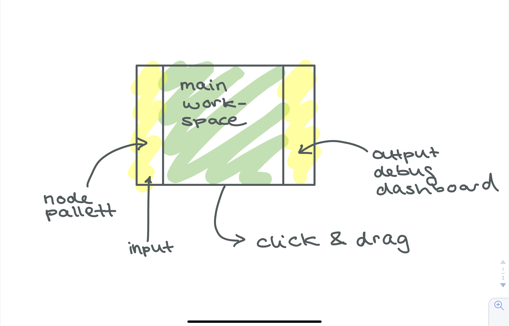

><i>Wichtig: Firefox unterstützt keine Midi Geräte.</i>

>Alle Interaktionsobjekte müssen sich im gleichen Netzwerk befinden.

>Interaktionsobjekte: Pi, Dj Mischpult mit USB Anschluss, Mac, Lampen mit Halterung von Osram ( 3 dimmende Lampen und eine Osram RGB)

>Vorraussetzungen: VNC Viewer, balena, node red, balena etcher, Pi mit eingestecktem Dj Mischpult (USB) und Zigbee Bride Stick.

1. Wir sind auf viele Probleme gestoßen, da sich der Rasperry Pi sehr lang nicht mit dem  Netzwerk verbinden konnte.
2. Zunächst haben wir die neue Software für den Rasperry Pi runtergeladen und ihn mithilfe der 
balena etcher software auf den Pi geflasht.

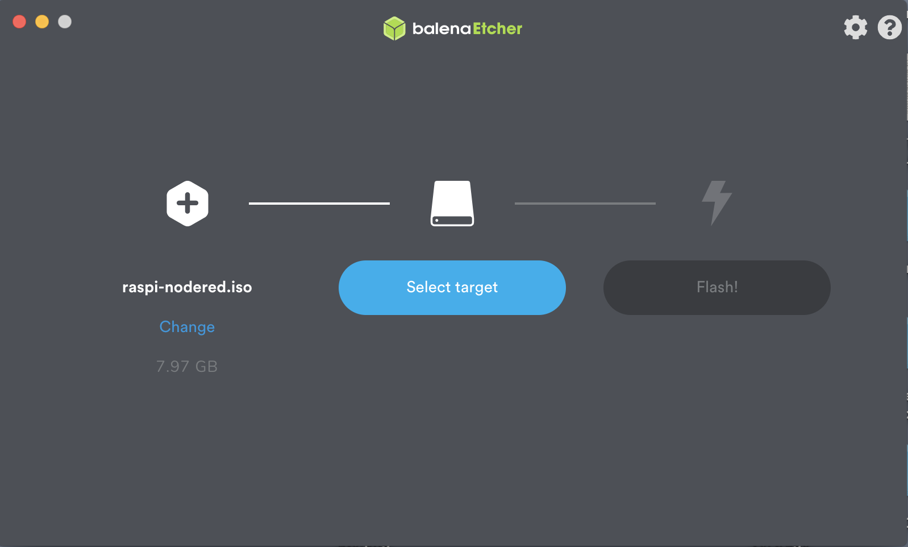

3. Durch das Programm VNC Viewer und der Ip Adresse unseres Pis (192.168.1.238) haben wir die Ansicht des Rasperry Pi auf dem Mac Computer angezeigt bekommen. So konnten wir auf dem Mac arbeiten, während die Änderungen parallel auf dem Pi passierten. man kann also in der Mac Konsole arbeiten, deployen und node red auf dem Pi refreshen. 

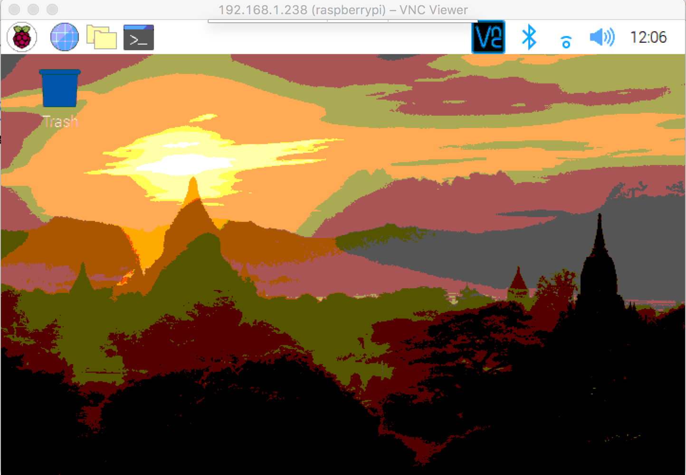

4. Auf der Website von [Phoscon](https://phoscon.de/de/conbee2/install) (Dresden Elektronik) haben wir die Befehle zum Installieren der deCONZ Software kopiert und manuell ins Terminal eingesetzt. Hier muss man darauf achten, dass man das ganze haargenau wie auf der Website beschrieben durchführt. Wir brauchen nämlich die Id der Lampen um sie in node red einfügen zu können.

### USB Zugriffsrecht für den Nutzer:

<kbd>sudo gpasswd -a $USER dialout</kbd>

### Phoscon Public-Key importieren

<kbd> wget -O - http://phoscon.de/apt/deconz.pub.key | \
           sudo apt-key add - </kbd>

### APT-Repository für deCONZ konfigurieren (stabel):

<kbd>sudo sh -c "echo 'deb http://phoscon.de/apt/deconz \
            $(lsb_release -cs) main' > \
            /etc/apt/sources.list.d/deconz.list"</kbd>

### APT-Paketliste aktualisieren

<kbd> sudo apt update</kbd>

### deCONZ installieren

<kbd> sudo apt install deconz</kbd>


>Wir haben ihm also mit den Befehlen der Website den Schlüssel gegeben, den Ort wo er die Pakete findet und den Installationsbefehl. All diese Befehle im Terminal des Pi's.

5. Nach der Installation wird eine Webadresse im Terminal angezeigt, die man manuell in die Suchleiste des Browser kopieren kann, um direkt auf die Conbee Seite weitergeleitet zu werden. Auf dieser kann man die Lichter manuell dimmen und die Farbe wechseln. Unsere Zugangsdaten:
Benutzer: pi kennwort: 12kabelfrei

6. In Nodered haben wir rechts in der Leiste unter der Kategorie Paletten verwalten die deconz Erweiterung installiert, damit man die Input Befehle der Lampen in der linken Leiste aufrufen kann. (input deconz input)

7. Bei der zuvor installierten conbee Steuerungsseite haben wir uns unter Get Settings den API Key von der Lampe kopiert, um diesen in node red einsetzten zu können. 

 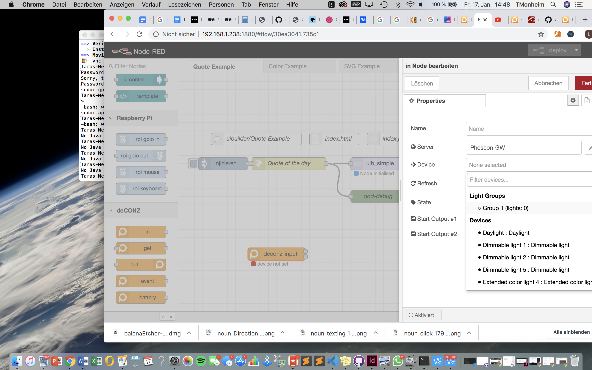

8. Auf Node Red setzten wir diesen key bei <kbd>deconz input</kbd> ein und wählen die Gruppe wie oben in dem Screenshot gezeigt aus. 

>wichtig: nicht vergessen auf node red zu deployen

Hier ein paar Beispiel Flows des Conbee Sticks auf nodered: [ConbeeStickFlows](https://flows.nodered.org/node/node-red-contrib-deconz)

9. Als Output haben wir die Brightness gewählt und erstmal einen slider mit dieser Brightness verknüpft um auszuprobieren, ob das ganze funktioniert. Den Slider konfigrieren wir in einem Range von 0 - 100. In der rechten Leiste von Node Red könenn wir uns unter <kbd>dashboard</kbd> das Ganze anzeigen lassen. 

10. Um das ganze mit einem Midi Gerät zu verbinden, haben wir aus der node library und der collection prototyping-lab von unserem Dozenten Martin Schneider den Flow kopiert und in node red eingesetzt. Als Midi Gerät haben wir ein Dj Pult mit USB Anschluss gewählt. 

Hier einmal der Link zu den Midi Geräten:


[Prototyping Lab Flows](https://flows.nodered.org/collection/Pok0Mfvj6Xqt)


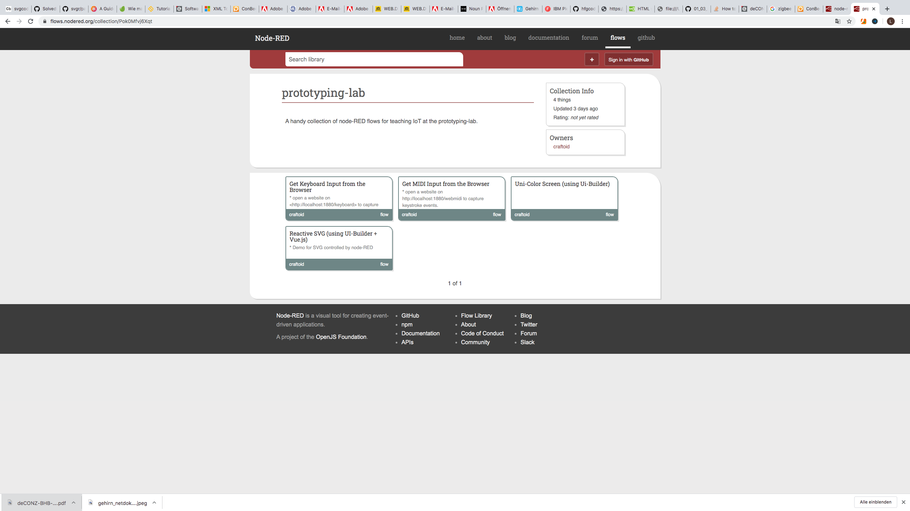
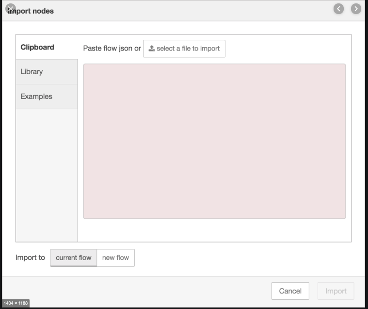
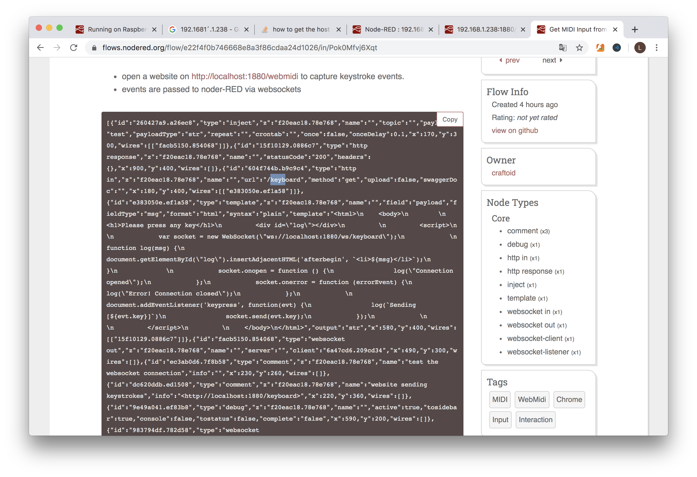

In der <a href="komplett.json">JSON</a> Datei findet man die Struktur unseres Flows und kann sich wenn man die einzelnden nodes anklickt die genauen properties anzeigen lassen.

11. In dem Html Code der Funktion <kbd>Vorlage</kbd> haben wir den localhost manuell geändert. 

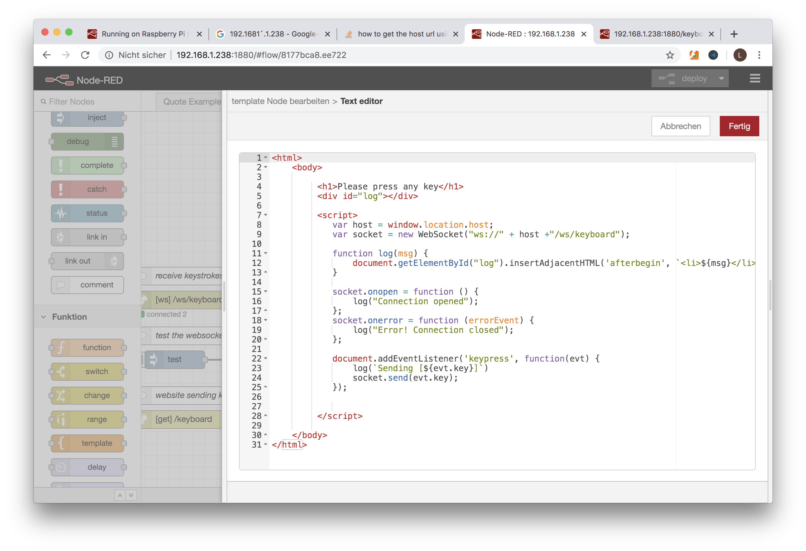

Den Output des Dj Pults kann man sich manuell im Browser Fenster anzeigen lassen. So findet man heraus, wie die verschiedenen Tasten oder Dreher attributiert worden sind. Diese Siete können wir aufrufen indem wir die Ip Adresse unseres Pis mit der des Midi Geräts in die Suchleiste eingeben. In unserem Fall: <kbd>192.168.1.238:1880</kbd>

In unserem Fall: der Drehknopf hatte die Eigenschaft: control change und die Drückknöpfe 
octave#. 
Hier die Zahlen: 
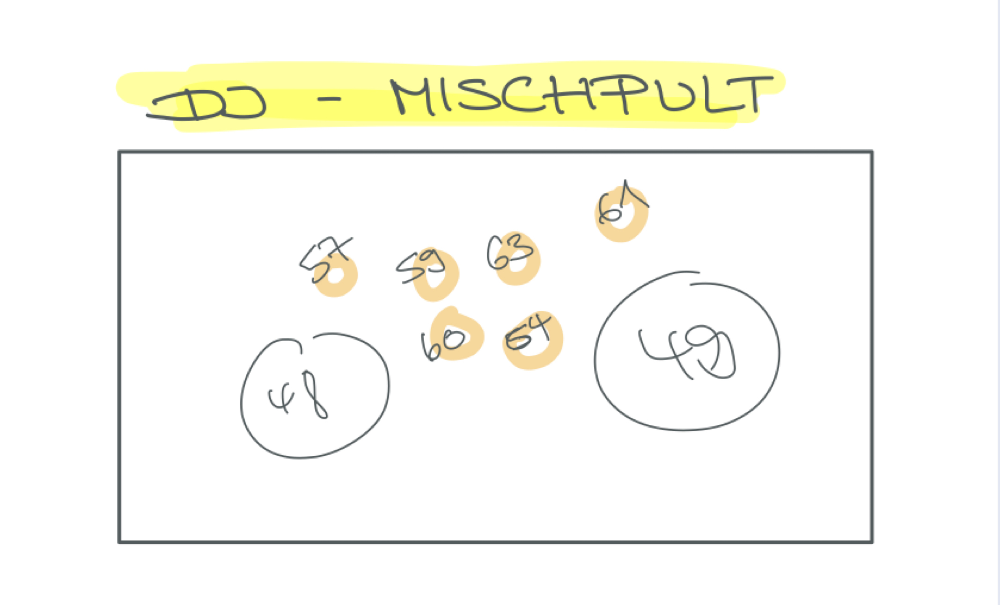

### Erklärung zu unserem Flow:

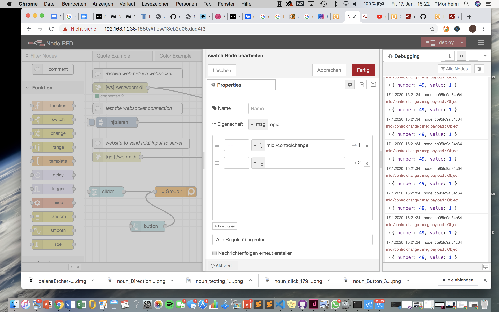

In der <kbd>switch</kbd> Funktion haben wir die Eigenschaft des Midi auf Control Change gestellt.
Das heißt es werden jetzt nur die Input der Drehknöpfe aufgenomnmen.  

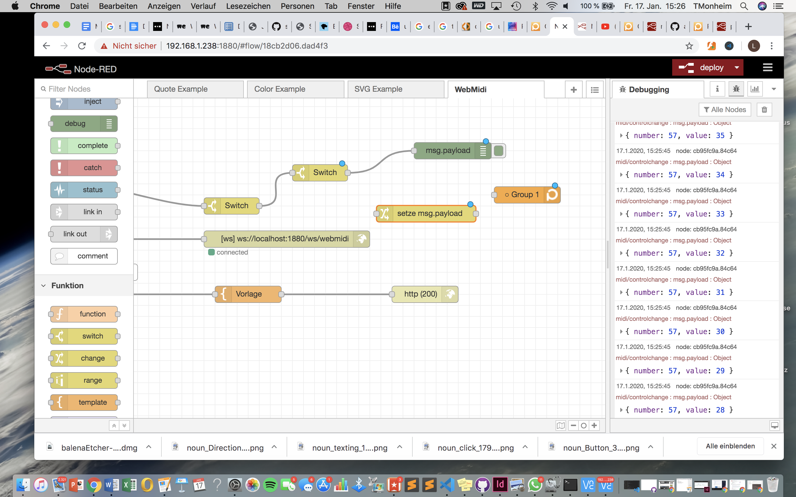

Bei der nächsten Switch Funktion haben wir das ganze so gefiltert, dass nur der Input von dem Drehknopf mit der Nummer 57 ankommt. In diesem Fall der Input des linken Regler. 
Dafür stellt man bei der zweiten <kbd>switch</kbd> Funktion den Befehl <i>msg.playload.number</i> ein und setzt das ganze auf die 57.

//Korrektur lesen 
//Strukturieren
//Wie der dimm Befehl verbunden wurde
//range 
//wie wir die Farbe eingestellt haben (kann man sich in dem komplett.flow anschauen // wenn ihr den Flow in node red einfach click and drag einsetzt, baut scih der automatisch auf und ihr könnt das rekonstruieren. ) 


